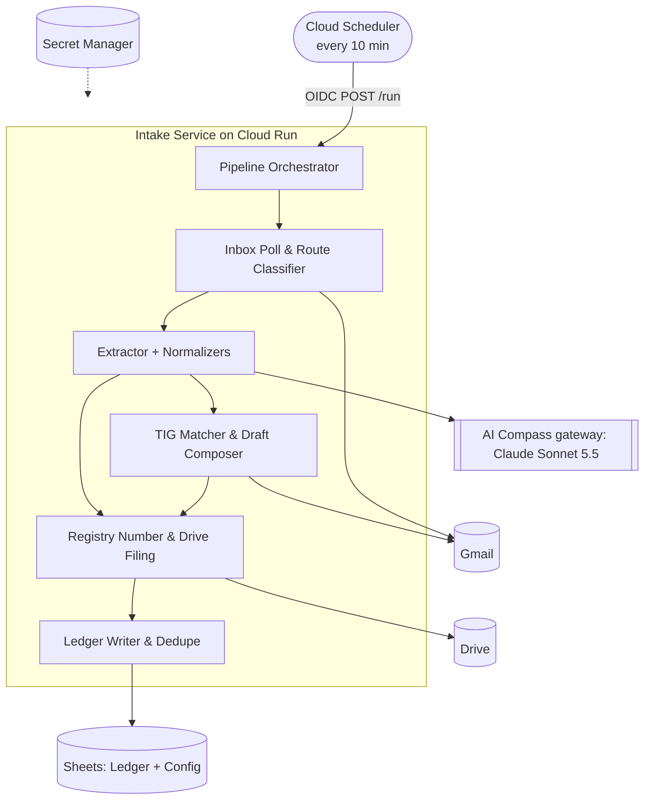

# Invoice Processing — Kibit

Kibit's back office currently names, files and books supplier and contractor invoices by
hand. This project builds an automated intake pipeline that watches a Gmail inbox,
extracts invoice data with a multimodal AI model, files a correctly named PDF to Google
Drive, and writes a correct row to a Google Sheets ledger. Contractor invoices are also
reconciled against the performance certificates (TIG) sent earlier in the same thread.
The primary users are the bookkeeping function and, for TIG mismatches, the project
manager who sent the certificate.

## Features

- EPIC-001: Inbox Intake & Routing
- EPIC-002: AI Extraction & Data Normalization
- EPIC-003: Registry Numbering & Drive Filing
- EPIC-004: Ledger Booking & Reconciliation
- EPIC-005: TIG Comparison & Exception Handling

## Architecture

A single Python service ("the Intake Service", a modular monolith) runs on **Cloud Run**.
**Cloud Scheduler** calls it every 10 minutes through an OIDC-authenticated `POST /run`.
Each run loads its configuration from the ledger sheet's `Config` tab and lists the
candidate Gmail messages. It then processes them **one at a time** through this pipeline:

Classify → Extract (Claude via AI Compass) → Normalize → [TIG route: Reconcile] →
Assign registry number → File to Drive → Book to ledger → Label.

There is no database. Gmail labels hold the processing state, Drive holds the files, and
Sheets holds the ledger. All three are read live on every run, so a run can safely be
repeated. A step that fails leaves the email untouched for the next run.

Gmail labels used as the state machine:

| Label | Meaning |
|---|---|
| `Kibit/Processed` | Filed and booked, no issue |
| `Kibit/Pending` | Filed and booked, TIG mismatch outstanding (a draft reply was created) |
| `Kibit/NeedsReview` | Ambiguous route or incomplete data. Never retried automatically |
| `Kibit/AwaitingTIG` | Contractor invoice with no TIG in the thread yet. Re-checked every run |



## Tech stack

- Python 3.12: `google-api-python-client`, `anthropic`, `google-genai`, `babel`, `python-dateutil`
- Multimodal extraction behind an `Extractor` interface, chosen by `EXTRACTOR_BACKEND`:
  - `ai_compass` (default): Claude Sonnet 5.5 through Kibit's AI Compass gateway (a LiteLLM
    proxy exposing the Anthropic Messages API). Configured by `AI_COMPASS_BASE_URL`
    (default `https://ai-compass.kibit.cloud`), `AI_COMPASS_MODEL` (default
    `claude-sonnet-5-5`), `AI_COMPASS_EFFORT` (default `medium`) and the key
    `AI_COMPASS_API_KEY`, or, when that is unset, the Secret Manager secret
    `kibit-ai-compass-api-key-<ENVIRONMENT>` in `GCP_PROJECT_ID`.
  - `gemini` (optional): `GEMINI_MODEL`, `GEMINI_API_KEY` /
    `kibit-gemini-api-key-<ENVIRONMENT>`. Only needed when this backend is selected.
- Google Cloud: Cloud Run, Cloud Scheduler, Secret Manager, Artifact Registry, Cloud
  Logging / Error Reporting / Monitoring, all in `europe-west1`
- Terraform for infrastructure, GitHub Actions for CI/CD
- `pytest`, `ruff`, `mypy`

## Getting started

**Prerequisites:** Python 3.12, `gcloud`, `docker`, `terraform >= 1.7`. You also need two
Google accounts with a ledger sheet (`Ledger` + `Config` tabs) and an "Invoices" Drive
folder in each:

- a **sandbox** account, used by staging and all tests
- the **production** shared mailbox

Credential setup is in
[docs/google-workspace-setup.md](docs/google-workspace-setup.md).

```bash
python3.12 -m venv .venv && source .venv/bin/activate
pip install -r requirements.txt -r requirements-dev.txt
```

**Test and lint:**

```bash
ruff check . && ruff format --check . && mypy intake/
pytest tests/unit
```

The fixture-set end-to-end suite runs against the sandbox account:
`pytest tests/e2e/fixture_set`.

**Run locally:** TODO. The specification doesn't give a local run command yet. The
service exposes `POST /run` and `GET /health` (`/healthz` is kept for the startup probe).

**Deploy:** Terraform in `infra/` provisions Cloud Run, Cloud Scheduler, Secret Manager
and CI identities. `.github/workflows/deploy.yml` deploys to staging automatically when CI
is green on `main`. Production is promoted after the fixture-set release gate and a
reviewer's approval. The ordered runbook (bootstrap, secrets, smoke test, rollback) is
[docs/deployment.md](docs/deployment.md).

## Specification

Stories, designs and plans live in the software factory project **Invoice processing**
and are read through the `software-factory` MCP server (see `INTEGRATION.md`).
